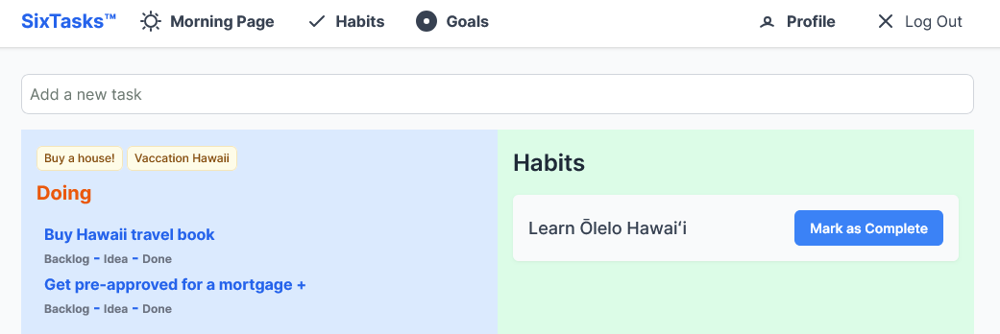

---
#
# By default, content added below the "---" mark will appear in the home page
# between the top bar and the list of recent posts.
# To change the home page layout, edit the _layouts/home.html file.
# See: https://jekyllrb.com/docs/themes/#overriding-theme-defaults
#
layout: home
---

> Plan your work for today and every day, then work your plan. 
> Margaret Thatcher 

## A different way to manage your day

__The SixTasks application is designed for simplicity and balance__
- It streamlines task management
- Fosters clarity through daily reflection (morning pages)
- Supports growth through consistent habits (habit builder) 

It’s the perfect companion for anyone looking to achieve more while maintaining focus and well-being.

[Try it now, it’s free!](https://app.sixtasks.com/users/sign_up) (for a limited time 😊)

### Recent posts/articles

